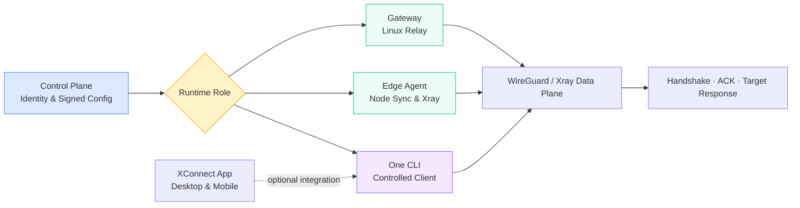

  

<h1 align="center">ai-workspace-xstream</h1>

<strong>Secure connectivity and edge runtimes for AI workspaces</strong>

  
  
  
  

  <a href="https://github.com/ai-workspace-xstream/.github/blob/main/profile/README-zh.md">简体中文</a> ｜ <a href="https://github.com/ai-workspace-xstream/.github/blob/main/profile/README-en.md">English</a>

---

## 🇬🇧 Organization overview

`ai-workspace-xstream` is the connectivity and edge-runtime organization for AI Workspace. We build the XConnect Zero Trust network as independently releasable, verifiable, and operable components: a control-plane contract, Linux Gateway, edge agent, controlled client CLI, cross-platform app, telemetry exporter, and operational documentation.

The system keeps network roles separate. The control plane owns identity and signed configuration; Gateway owns server-side relay; Edge Agent owns node synchronization; One and XConnect App own the controlled client runtime.

### Mission and delivery principles

* **One control-plane authority:** clients and nodes consume protected APIs and signed configuration instead of accessing the control-plane database directly.
* **Signed configuration and immutable artifacts:** reject unsigned, expired, cross-network, or cross-Gateway configuration; verify release artifacts with explicit versions and `SHA256SUMS`.
* **Runtime-only secrets:** invitations, tokens, private keys, and TLS material are injected at runtime or kept in protected directories, never committed to Git or printed in logs.
* **Separated runtime roles:** Gateway, Edge Agent, One, and the App own separate state and lifecycle boundaries.
* **End-to-end verification:** service state alone is not acceptance; verify the WireGuard handshake, data plane, ACK, and a real target response.

### Main entry points

* [XConnect Console](https://console.svc.plus/products/xconnect)
* [Deployment routes runbook](https://github.com/ai-workspace-xstream/docs/blob/main/runbooks/2026-10-03-xconnect-deployment-routes.md)
* [Architecture and operations docs](https://github.com/ai-workspace-xstream/docs)
* [Client releases](https://github.com/ai-workspace-xstream/xconnect-app/releases)

---

## 🏛️ Core pillars

<table>
<tr>
<td width="25%" align="center" valign="top">
<h3>Zero Trust</h3>

Device identity, short-lived invitations, signed configuration and session renewal.

</td>
<td width="25%" align="center" valign="top">
<h3>Edge & Relay</h3>

Edge Agent manages node synchronization; Gateway provides the Linux relay runtime.

</td>
<td width="25%" align="center" valign="top">
<h3>Controlled Clients</h3>

One CLI supports macOS, Linux and Windows; the App provides desktop and mobile interfaces.

</td>
<td width="25%" align="center" valign="top">
<h3>Observability</h3>

Xray metrics, node logs, diagnostics and documented operational acceptance.

</td>
</tr>
</table>

---

## 🔄 From signed configuration to a usable connection

1. The control plane issues short-lived credentials and signed configuration bound to a device or Gateway.
2. Gateway, Edge Agent, or One validates the configuration locally and writes only to its protected state directory.
3. Xray and WireGuard establish the data plane; each client uses only its own interface and state.
4. Acceptance verifies service state, the latest handshake, ACK, and a real target response.

---

## 📦 Repository map

| Repository | Type / role | Description |
| --- | --- | --- |
| [`xconnect-gateway`](https://github.com/ai-workspace-xstream/xconnect-gateway) | `Linux Relay Runtime` | Independent Linux Gateway for enrollment, session renewal, signed Gateway configuration, and WireGuard/Xray application. |
| [`xconnect-edge-agent`](https://github.com/ai-workspace-xstream/xconnect-edge-agent) | `Edge Control Agent` | Node-side agent for configuration sync, heartbeats, Xray lifecycle, and the Caddy HTTPS/TLS entry point. |
| [`xconnect-one`](https://github.com/ai-workspace-xstream/xconnect-one) | `Controlled Client CLI` | Independent Go CLI for the device-bound WireGuard/Xray client runtime and local state. |
| [`xconnect-app`](https://github.com/ai-workspace-xstream/xconnect-app) | `Desktop & Mobile Client` | Flutter client for node import, proxy modes, tunnel workflows, diagnostics, and platform packages. |
| [`xray-exporter`](https://github.com/ai-workspace-xstream/xray-exporter) | `Telemetry Exporter` | Exports Xray/V2Ray Stats API and access-log data as Prometheus metrics. |
| [`docs`](https://github.com/ai-workspace-xstream/docs) | `Architecture & Runbooks` | Requirements, plans, architecture, decisions, runbooks, incidents, and release records. |
| [`.github`](https://github.com/ai-workspace-xstream/.github) | `Organization Profile` | Organization-level overview, project entry points, and collaboration boundaries. |

---

## 🚀 Deployment routes

See the complete [XConnect / Proxy-Server deployment routes runbook](https://github.com/ai-workspace-xstream/docs/blob/main/runbooks/2026-10-03-xconnect-deployment-routes.md).

| Route | Control plane | Components / platforms |
| --- | --- | --- |
| Standalone Proxy-Server | Standalone | Linux node with Caddy and Xray |
| Full Stack Proxy-Server | Accounts + Vault | Edge Agent, TLS synchronization and monitoring |
| Data-plane components | Install before enrollment | Gateway: Linux; One: macOS / Linux / Windows |
| Full Stack XConnect Zero | Zero API | Gateway and One enrollment, signed config and ACK |

Choose a route in the deployment guide. CLI installation and network enrollment are separate steps.

---

  <a href="https://github.com/ai-workspace-xstream/docs/blob/main/runbooks/2026-10-03-xconnect-deployment-routes.md"><strong>Complete deployment guide</strong></a> 
  Secure · Signed · Observable · Cross-platform

