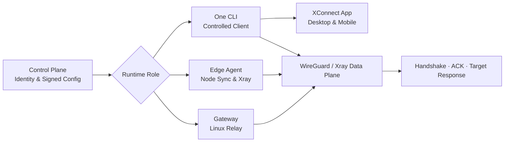

<p align="center">
  <a href="README.md">Index</a> · <a href="README-zh.md">简体中文</a>
</p>

# ai-workspace-xstream

## 🇬🇧 Organization overview

`ai-workspace-xstream` is the connectivity and edge-runtime organization for AI Workspace. We build the XConnect Zero Trust network as independently releasable, verifiable, and operable components: a control-plane contract, Linux Gateway, edge agent, controlled client CLI, cross-platform app, telemetry exporter, and operational documentation.

The system keeps network roles separate. The control plane owns identity and signed configuration; Gateway owns server-side relay; Edge Agent owns node synchronization; One and XConnect App own the controlled client runtime.

### Mission and delivery principles

* **One control-plane authority:** clients and nodes consume protected APIs and signed configuration instead of accessing the control-plane database directly.
* **Signed configuration and immutable artifacts:** reject unsigned, expired, cross-network, or cross-Gateway configuration; verify release artifacts with explicit versions and `SHA256SUMS`.
* **Runtime-only secrets:** invitations, tokens, private keys, and TLS material are injected at runtime or kept in protected directories, never committed to Git or printed in logs.
* **Separated runtime roles:** Gateway, Edge Agent, One, and the App own separate state and lifecycle boundaries.
* **End-to-end verification:** service state alone is not acceptance; verify the WireGuard handshake, data plane, ACK, and a real target response.

### Main entry points

* [XConnect Console](https://console.svc.plus/products/xconnect)
* [Deployment routes runbook](https://github.com/ai-workspace-xstream/docs/blob/main/runbooks/2026-10-03-xconnect-deployment-routes.md)
* [Architecture and operations docs](https://github.com/ai-workspace-xstream/docs)
* [Client releases](https://github.com/ai-workspace-xstream/xconnect-app/releases)

---

## 🏛️ Core pillars

### 🔐 Zero Trust Control Plane

Device identity, short-lived invitations, signed configuration, session renewal, and ACK form the network control boundary. XConnect One and Gateway validate signatures, expiry, network, and role binding locally. See the [accounts API](https://github.com/ai-workspace-services/accounts) for the control-plane implementation reference.

### 🌐 Edge & Relay Runtime

`xconnect-edge-agent` handles node configuration synchronization, heartbeats, Xray lifecycle, and the Caddy TLS entry point. `xconnect-gateway` provides an independent Linux Server relay/service. Neither repository should contain long-lived credentials or network invitations.

### 💻 Controlled Client Experience

`xconnect-one` is an independently released Go CLI for protected local Xray/WireGuard runtimes. `xconnect-app` provides Flutter desktop and mobile interfaces, node management, and diagnostics while preserving an explicit boundary with the CLI.

### 📊 Observable & Operable

`xray-exporter` converts Xray/V2Ray Stats API data and access logs into Prometheus metrics. `docs` maintains requirements, architecture, decisions, runbooks, incidents, and release notes. Acceptance must cover service state, handshake, data plane, and user-visible results.

---

## 🔄 From signed configuration to a usable connection



1. The control plane issues short-lived credentials and signed configuration bound to a device or Gateway.
2. Gateway, Edge Agent, or One validates the configuration locally and writes only to its protected state directory.
3. Xray and WireGuard establish the data plane; each client uses only its own interface and state.
4. Acceptance verifies service state, the latest handshake, ACK, and a real target response.

---

## 📦 Repository map

| Repository | Type / role | Description |
| --- | --- | --- |
| [`xconnect-gateway`](https://github.com/ai-workspace-xstream/xconnect-gateway) | `Linux Relay Runtime` | Independent Linux Gateway for enrollment, session renewal, signed Gateway configuration, and WireGuard/Xray application. |
| [`xconnect-edge-agent`](https://github.com/ai-workspace-xstream/xconnect-edge-agent) | `Edge Control Agent` | Node-side agent for configuration sync, heartbeats, Xray lifecycle, and the Caddy HTTPS/TLS entry point. |
| [`xconnect-one`](https://github.com/ai-workspace-xstream/xconnect-one) | `Controlled Client CLI` | Independent Go CLI for the device-bound WireGuard/Xray client runtime and local state. |
| [`xconnect-app`](https://github.com/ai-workspace-xstream/xconnect-app) | `Desktop & Mobile Client` | Flutter client for node import, proxy modes, tunnel workflows, diagnostics, and platform packages. |
| [`xray-exporter`](https://github.com/ai-workspace-xstream/xray-exporter) | `Telemetry Exporter` | Exports Xray/V2Ray Stats API and access-log data as Prometheus metrics. |
| [`docs`](https://github.com/ai-workspace-xstream/docs) | `Architecture & Runbooks` | Requirements, plans, architecture, decisions, runbooks, incidents, and release records. |
| [`.github`](https://github.com/ai-workspace-xstream/.github) | `Organization Profile` | Organization-level overview, project entry points, and collaboration boundaries. |

---

## 🚀 Deployment routes

See the complete [XConnect / Proxy-Server deployment routes runbook](https://github.com/ai-workspace-xstream/docs/blob/main/runbooks/2026-10-03-xconnect-deployment-routes.md).

### Proxy-Server standalone

```bash
curl -fsSL https://raw.githubusercontent.com/ai-workspace-xstream/xconnect-edge-agent/main/scripts/setup-proxy.sh | \
  bash -s -- --node <node-domain> --standalone
```

### Proxy-Server Full Stack

Inject runtime credentials through Vault or a Secret Manager first, then run:

```bash
curl -fsSL https://raw.githubusercontent.com/ai-workspace-xstream/xconnect-edge-agent/main/scripts/setup-proxy.sh | \
  bash -s -- --node "$AGENT_PROXY_DOMAIN" --with-observability
```

### XConnect Zero CLI installation

```bash
curl -fsSL https://install.svc.plus/xconnect-gateway | \
  sudo env XCONNECT_GATEWAY_VERSION=<approved-release-tag> bash

curl -fsSL https://install.svc.plus/xconnect-one | \
  sudo env XCONNECT_ONE_VERSION=<approved-release-tag> bash
```

The installers download and verify the CLI only. Enrollment, signed configuration, runtime startup, and data-plane acceptance continue through the relevant runbook.

---

📘 [Complete deployment routes runbook](https://github.com/ai-workspace-xstream/docs/blob/main/runbooks/2026-10-03-xconnect-deployment-routes.md)

Secure · Signed · Observable · Cross-platform · AI-workspace ready
