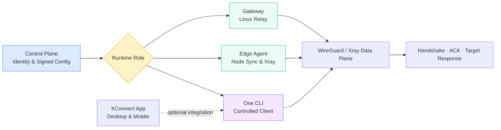

  

<h1 align="center">ai-workspace-xstream</h1>

<strong>AI 工作区安全连接与边缘运行时</strong>

  
  
  
  

  <a href="https://github.com/ai-workspace-xstream/.github/blob/main/profile/README-zh.md">简体中文</a> ｜ <a href="https://github.com/ai-workspace-xstream/.github/blob/main/profile/README-en.md">English</a>

---

## 🇨🇳 组织概览

`ai-workspace-xstream` 是 AI Workspace 的连接与边缘运行时组织。我们围绕 XConnect Zero Trust 网络，将控制面、Linux Gateway、边缘节点、受控客户端、跨平台 App 与可观测组件拆分为可独立发布、可验证和可运维的开源项目。

我们的目标不是把所有能力塞进一个客户端，而是让每个网络角色拥有清晰的边界：控制面负责身份与签名配置，Gateway 负责服务端转发，Edge Agent 负责节点同步，One 和 XConnect App 负责受控客户端运行时。

### 我们的使命与交付准则

* **控制面唯一可信**：节点和客户端通过受保护的 API 获取设备绑定、签名和过期检查后的配置，不直接访问控制面数据库。
* **签名配置与不可变构件**：拒绝未签名、过期、跨网络或跨 Gateway 的配置；发布制品使用明确版本和 `SHA256SUMS` 校验。
* **运行时最小权限**：邀请、Token、私钥和 TLS 材料只在运行时注入或保存在受保护目录，不进入 Git、日志或公开命令示例。
* **角色与平台隔离**：Linux Gateway、边缘节点、One CLI 和桌面/移动 App 各自维护自己的状态与生命周期，避免共享可变状态。
* **可验证的网络路径**：服务状态、WireGuard handshake、Xray 数据面和目标服务响应分别验证；单个进程 active 不等于端到端连接成功。

### 常用入口

* [XConnect Console](https://console.svc.plus/products/xconnect)
* [完整部署路线文档](https://github.com/ai-workspace-xstream/docs/blob/main/runbooks/2026-10-03-xconnect-deployment-routes.md)
* [架构与运行文档](https://github.com/ai-workspace-xstream/docs)
* [客户端发布](https://github.com/ai-workspace-xstream/xconnect-app/releases)

---

## 🏛️ 四大核心支柱

<table>
<tr>
<td width="25%" align="center" valign="top">
<h3>零信任控制面</h3>

设备身份、一次性邀请、签名配置与会话续期，连接受控节点。

</td>
<td width="25%" align="center" valign="top">
<h3>边缘节点与中继</h3>

Edge Agent 同步节点配置；Gateway 提供 Linux 服务端中继。

</td>
<td width="25%" align="center" valign="top">
<h3>受控客户端</h3>

One 支持 macOS、Linux、Windows；App 提供桌面与移动端界面。

</td>
<td width="25%" align="center" valign="top">
<h3>可观测与运维</h3>

Xray 指标、节点日志、诊断与运行手册支撑连接验收。

</td>
</tr>
</table>

---

## 🔄 从签名配置到可用连接

1. 控制面签发设备或 Gateway 绑定的短期凭据与签名配置。
2. Gateway、Edge Agent 或 One 在本地验证配置，再写入各自受保护的状态目录。
3. Xray 与 WireGuard 建立数据面连接，客户端只使用自己拥有的接口和状态。
4. 通过服务状态、最新 handshake、ACK 和一个真实目标响应完成验收。

---

## 📦 核心仓库矩阵

| 仓库 | 类型 / 定位 | 说明 |
| --- | --- | --- |
| [`xconnect-gateway`](https://github.com/ai-workspace-xstream/xconnect-gateway) | `Linux Relay Runtime` | 独立 Linux Gateway；执行加入、会话续期、签名 Gateway 配置同步、WireGuard/Xray 应用与 ACK。 |
| [`xconnect-edge-agent`](https://github.com/ai-workspace-xstream/xconnect-edge-agent) | `Edge Control Agent` | 节点侧控制代理；同步配置、上报心跳、管理 Xray 生命周期，并由 Caddy 提供 HTTPS/TLS 入口。 |
| [`xconnect-one`](https://github.com/ai-workspace-xstream/xconnect-one) | `Controlled Client CLI` | 独立 Go CLI；管理设备绑定的 WireGuard/Xray 客户端运行时和本地状态。 |
| [`xconnect-app`](https://github.com/ai-workspace-xstream/xconnect-app) | `Desktop & Mobile Client` | Flutter 客户端；提供节点导入、代理模式、Tunnel、诊断和平台打包产物。 |
| [`xray-exporter`](https://github.com/ai-workspace-xstream/xray-exporter) | `Telemetry Exporter` | 采集 Xray/V2Ray Stats API 与访问日志并导出 Prometheus 指标。 |
| [`docs`](https://github.com/ai-workspace-xstream/docs) | `Architecture & Runbooks` | 维护需求、计划、架构、决策、Runbook、故障和发布记录。 |
| [`.github`](https://github.com/ai-workspace-xstream/.github) | `Organization Profile` | 组织级说明、项目入口和协作边界。 |

---

## 🚀 部署路线

完整说明见：[XConnect / Proxy-Server 部署路线总览](https://github.com/ai-workspace-xstream/docs/blob/main/runbooks/2026-10-03-xconnect-deployment-routes.md)。

| 路线 | 控制面 | 组件与平台 |
| --- | --- | --- |
| Proxy-Server 独立部署 | standalone | Linux 节点、Caddy、Xray |
| Proxy-Server Full Stack | Accounts + Vault | Edge Agent、证书同步、自监控 |
| 数据面组件安装 | 安装后继续配置与注册 | Gateway：Linux；One：macOS / Linux / Windows |
| XConnect Zero Full Stack | Zero API | Gateway / One 注册、签名配置、ACK |

按部署指南选择对应路线；CLI 安装、网络注册和业务连通验收分别执行。

---

  <a href="https://github.com/ai-workspace-xstream/docs/blob/main/runbooks/2026-10-03-xconnect-deployment-routes.md"><strong>完整部署路线文档</strong></a> 
  Secure · Signed · Observable · Cross-platform

