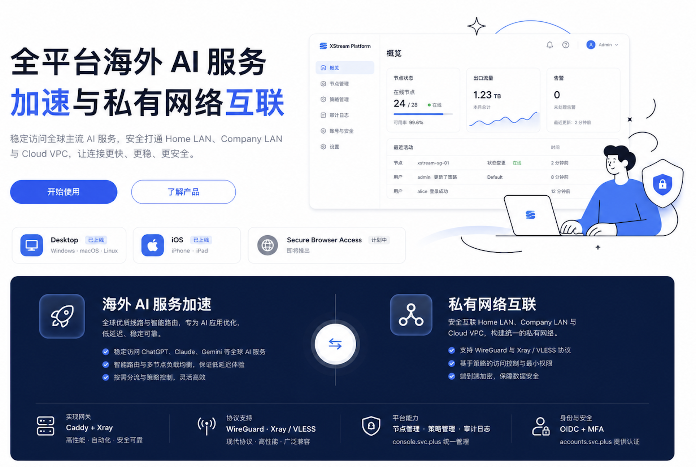
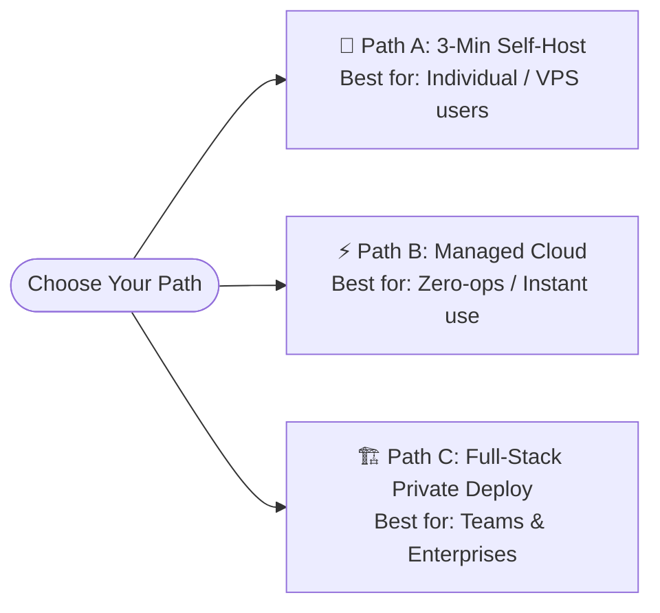

<p align="center">
  
</p>

<p align="center">
  <a href="https://console.svc.plus/products/xconnect"><strong>🚀 Launch XConnect Console</strong></a>
  ·
  <a href="https://github.com/ai-workspace-xstream/xconnect-app/releases/tag/main-149"><strong>📱 Download Client App</strong></a>
  ·
  <a href="https://github.com/ai-workspace-xstream/agent.svc.plus"><strong>⚡ One-Click Script</strong></a>
</p>

<p align="center">
  <a href="https://console.svc.plus/products/xconnect"></a>
  <a href="https://github.com/ai-workspace-xstream/xconnect-app/releases/tag/main-149"></a>
  
  <a href="https://github.com/ai-workspace-xstream"></a>
</p>

<p align="center">
  <a href="./README.md">🇨🇳 中文向导</a> ｜ <b>🇬🇧 English Guide</b>
</p>

---

## Welcome to the XConnect / XStream Open-Source Ecosystem

**XConnect** is a next-generation **AI Workspace Connector & Network Acceleration Suite** designed for developers, AI practitioners, and teams. Whether you need a 3-minute self-hosted node, a managed zero-maintenance cloud platform, or a full-stack multi-tenant enterprise deployment, XConnect provides a streamlined, wizard-guided journey.

---

### 🧭 Choose Your Path



---

#### 🚀 Path A: 3-Minute Quick Self-Host (1 Domain + 1 VPS)

> **Target Audience**: Users with a Linux VPS and a domain who want the cleanest, fastest way to deploy a dedicated proxy/acceleration node.

1. **Prerequisites**: Point an A record of your domain (e.g. `xhttp.example.com`) to your VPS IP address.
2. **One-Command Setup** (Execute in VPS SSH terminal):
   ```bash
   curl -fsSL https://raw.githubusercontent.com/cloud-neutral-toolkit/agent.svc.plus/main/scripts/setup-proxy.sh | \
     bash -s -- --node xhttp.example.com
   ```
   *(💡 For standalone self-hosting, you can also append `--standalone`)*
3. **Fully Automated Out-of-the-Box**:
   - Automated HTTPS TLS certificate provisioning & renewal (powered by Caddy)
   - Pre-configured Xray-core (supporting modern XHTTP & TCP Vision protocols)
   - Kernel-level low-latency TCP BBR + FQ optimization enabled automatically
   - **Outputs your ready-to-use `vless://...` node link directly in the terminal!**
4. **Client Connection**:
   - 🌟 **Recommended Native App**: Download **[XConnect Client App (85% Ready Preview)](https://github.com/ai-workspace-xstream/xconnect-app/releases/tag/main-149)** with native GUI for macOS, Windows, iOS, and Linux.
   - 📱 **Or Universal Clients**: Import the output link directly into OneXray, v2rayN, v2rayNG, Sing-box, or Surge.

---

#### ⚡ Path B: Zero-Ops Managed Cloud Service (Out of the Box)

> **Target Audience**: Users who want fast, stable acceleration for Cursor, ChatGPT, Claude, GitHub, and global AI APIs without buying or maintaining servers.

- 👉 **Direct Console Access**: **[https://console.svc.plus/products/xconnect](https://console.svc.plus/products/xconnect)**
- **Highlights**:
  - Secure, passwordless 1-click login with **GitHub OAuth** & **Google OAuth**.
  - Intelligent global edge routing with low latency and high reliability.
  - Web console provides 1-click subscription distribution and client sync.

---

#### 🏗️ Path C: Full-Stack Open-Source Deployment (Web UI + Multi-Tenant DB)

> **Target Audience**: Enterprises, development teams, or geeks who need a self-hosted Web console, multi-tenant authentication, automated node clustering, and custom clients.

Our organization provides a complete 100% open-source repository matrix:

| Repository | Role & Responsibilities | Tech Stack |
| :--- | :--- | :--- |
| 🌐 **[portal](https://github.com/ai-workspace-xstream/portal)** | Modern Web UI console (multi-tenant management, OAuth auth, node monitoring) | Next.js, React, Tailwind CSS |
| 🤖 **[agent.svc.plus](https://github.com/ai-workspace-xstream/agent.svc.plus)** | Node lightweight control daemon (config auto-sync, Xray lifecycle, TLS certs) | Go, Caddy, Xray-core |
| 🗄️ **[postgresql.svc.plus](https://github.com/ai-workspace-xstream/postgresql.svc.plus)** | High-availability multi-tenant database & secure TLS tunnel stack | PostgreSQL, Stunnel |
| 📱 **[xconnect-app](https://github.com/ai-workspace-xstream/xconnect-app)** | Cross-platform client app (system proxy, packet tunnel, subscription sync) | Flutter, Go Mobile, Swift |
| 📚 **[docs](https://github.com/ai-workspace-xstream/docs)** | Architecture design, technical specs, operations runbooks, and postmortems | Markdown |

---

### 📱 Client Download Center (XConnect App)

> Current development status is ~**85%** complete. Community feedback and issues are welcome!

| Platform | Supported Architecture | Status | Download Link |
| :--- | :--- | :--- | :--- |
| **macOS** | Apple Silicon (arm64) | ✅ Ready & Tested | [Download DMG](https://github.com/ai-workspace-xstream/xconnect-app/releases/tag/main-149) |
| **Windows** | x64 / x86_64 | ✅ Ready & Tested | [Download MSI / ZIP](https://github.com/ai-workspace-xstream/xconnect-app/releases/tag/main-149) |
| **iOS** | arm64 | ✅ Preview Test | [Download IPA / Release Page](https://github.com/ai-workspace-xstream/xconnect-app/releases/tag/main-149) |
| **Linux** | x64 / amd64 | ⚠️ Preview Test | [Download AppImage / DEB](https://github.com/ai-workspace-xstream/xconnect-app/releases/tag/main-149) |
| **Android** | arm64 | ⚠️ Preview Test | [Download APK](https://github.com/ai-workspace-xstream/xconnect-app/releases/tag/main-149) |

---

<p align="center">
  <a href="https://console.svc.plus/products/xconnect"><strong>🚀 Launch XConnect Console</strong></a>
</p>
