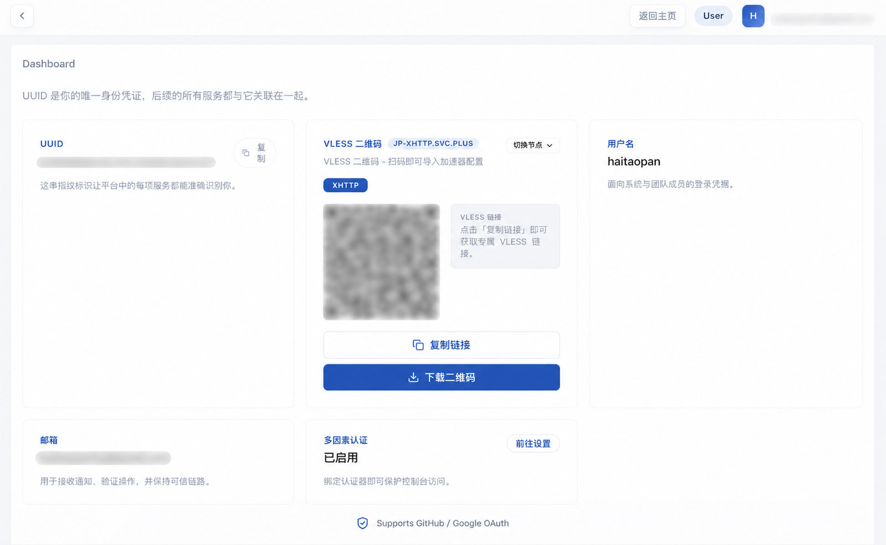

  

<h1 align="center">ai-workspace-xstream</h1>

<strong>AI acceleration proxy and private network connectivity</strong>

  
  
  

  <a href="#中文">中文</a> ｜ <a href="#english">English</a>

<table>
<tr>
<td valign="top" width="50%">

## 中文

`ai-workspace-xstream` 是面向全球 AI 服务访问与私有网络互联的组织。

### 一句话

把海外 AI 服务加速、私有网络互联、节点同步和安全访问，整合成一个真实在线运行的产品体系。

### 关键能力

- 海外 AI 服务加速
- 私有网络互联与安全接入
- Caddy / Xray 隧道与观测代理
- 节点、策略与同步管理

### 线上服务

- 真实生产环境持续运行
- 支持 GitHub OAuth 登录
- 支持 Google OAuth 登录
- 面向真实用户和真实节点运行

### 入口

- [XStream 产品主页](https://console.svc.plus/products/xstream)
- [组织主页](https://github.com/ai-workspace-xstream)

</td>
<td valign="top" width="50%">

## English

`ai-workspace-xstream` is the organization behind global AI service acceleration and private network connectivity.

### One line

We turn overseas AI acceleration, private network connectivity, node sync, and secure access into one live product system.

### Core capabilities

- Global AI service acceleration
- Private network connectivity and secure access
- Caddy / Xray tunnel and observability proxy
- Node, policy, and sync management

### Live service

- Running continuously in production
- Supports GitHub OAuth login
- Supports Google OAuth login
- Built for real users and real nodes in production

### Entry points

- [XStream Product Homepage](https://console.svc.plus/products/xstream)
- [Organization Page](https://github.com/ai-workspace-xstream)

</td>
</tr>
</table>

---

  <strong>真实在线运行 · 支持 GitHub / Google OAuth</strong>

  <strong>Live production service · GitHub / Google OAuth supported</strong>

