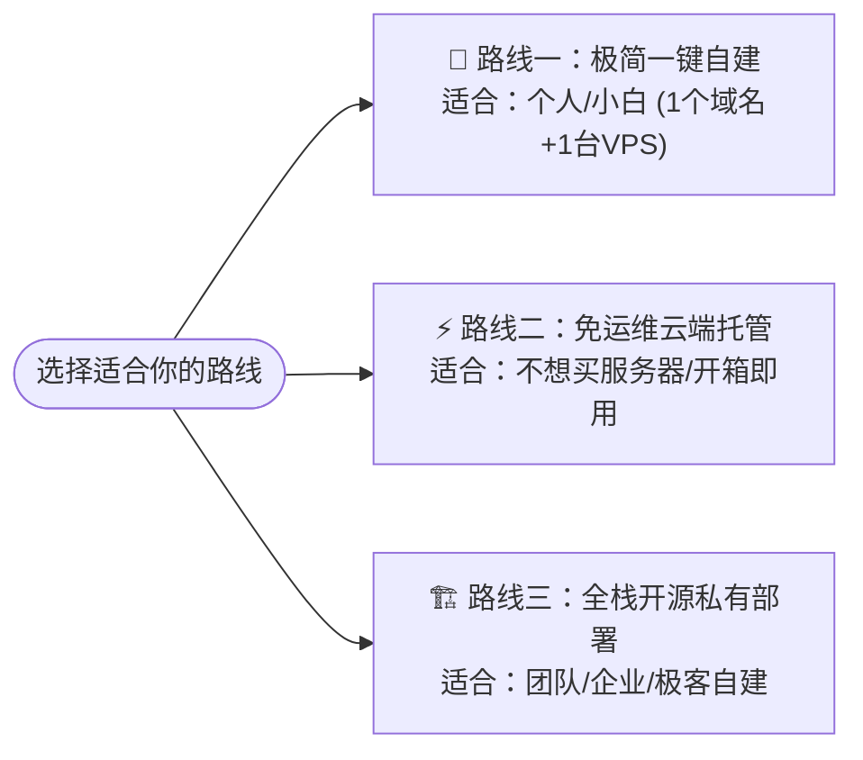

<p align="center">
  
</p>

<p align="center">
  <a href="https://console.svc.plus/products/xconnect"><strong>🚀 访问 XConnect 控制台</strong></a>
  ·
  <a href="https://github.com/ai-workspace-xstream/xconnect-app/releases/tag/main-149"><strong>📱 客户端下载</strong></a>
  ·
  <a href="https://github.com/ai-workspace-xstream/agent.svc.plus"><strong>⚡ 一键自建脚本</strong></a>
</p>

<p align="center">
  <a href="https://console.svc.plus/products/xconnect"></a>
  <a href="https://github.com/ai-workspace-xstream/xconnect-app/releases/tag/main-149"></a>
  
  <a href="https://github.com/ai-workspace-xstream"></a>
</p>

<p align="center">
  <b>🇨🇳 中文向导</b> ｜ <a href="./README.en.md">🇬🇧 English Guide</a>
</p>

---

## 欢迎使用 XConnect / XStream 开源生态

**XConnect** 是专为开发者、AI 爱好者与团队打造的 **AI 工作空间连接器与网络加速体系**。无论你是想要 3 分钟一键自建专属节点，还是开箱即用的免运维云服务，亦或是搭建私有多租户加速平台，这里都提供了完整的向导式解决方案。

---

### 🧭 三大使用路线（找到最适合你的方式）



---

#### 🚀 路线一：3 分钟极简一键自建（只要 1 个域名 + 1 台 VPS）

> **适合人群**：手头有一台 Linux VPS 和一个域名的个人用户，想用最简单、最干净的方式搭建专属加速节点。

1. **准备工作**：将你的域名（例如 `xhttp.example.com`）解析 A 记录到你的 VPS IP 地址。
2. **一行命令部署**（SSH 登录你的 VPS 后执行）：
   ```bash
   curl -fsSL https://raw.githubusercontent.com/cloud-neutral-toolkit/agent.svc.plus/main/scripts/setup-proxy.sh | \
     bash -s -- --node xhttp.example.com
   ```
   *(💡 纯独立自建亦可添加 `--standalone` 参数)*
3. **全自动就绪**：
   - 自动申请与续期 HTTPS TLS 证书（Caddy 驱动）
   - 自动配置 Xray-core（支持 XHTTP 与 TCP Vision 协议）
   - 自动开启 Linux 内核级低延迟 BBR + FQ 优化
   - **终端即刻输出 `vless://...` 节点导入链接**！
4. **客户端连接**：
   - 🌟 **推荐尝鲜自研客户端**：下载 **[XConnect 客户端（完成度 85% 体验版）](https://github.com/ai-workspace-xstream/xconnect-app/releases/tag/main-149)**（支持 macOS / Windows / iOS / Linux 原生界面）
   - 📱 **或使用通用客户端**：复制终端输出的链接，直接导入至 OneXray、v2rayN、v2rayNG、Sing-box、Surge 等客户端即可开始加速。

---

#### ⚡ 路线二：免运维云端托管服务（开箱即用 · 零维护）

> **适合人群**：不想买 VPS、不想折腾 Linux 运维，需要稳定加速访问 Cursor、ChatGPT、Claude、GitHub 与海外 AI API 的用户。

- 👉 **直接登录控制台**：**[https://console.svc.plus/products/xconnect](https://console.svc.plus/products/xconnect)**
- **特性**：
  - 支持 **GitHub OAuth** 与 **Google OAuth** 一键安全免密登录。
  - 全球优质节点自动调度与智能路由，低延迟、高可用。
  - Web 控制台支持一键订阅分发与客户端联动。

---

#### 🏗️ 路线三：全栈开源私有化部署（前后端 + 多租户 DB）

> **适合人群**：企业、技术团队或极客开发者，需要自建完整的 Web 控制台、多租户鉴权体系、节点自动化集群与私有客户端。

本组织提供全套 100% 开源项目矩阵：

| 开源仓库 | 定位与职责 | 技术栈 |
| :--- | :--- | :--- |
| 🌐 **[portal](https://github.com/ai-workspace-xstream/portal)** | 现代化 Web 前端与运营控制台（多租户管理、OAuth 认证、节点监控） | Next.js, React, Tailwind CSS |
| 🤖 **[agent.svc.plus](https://github.com/ai-workspace-xstream/agent.svc.plus)** | 节点轻量级控制守护进程（配置自动同步、Xray 进程生命周期、TLS 证书） | Go, Caddy, Xray-core |
| 🗄️ **[postgresql.svc.plus](https://github.com/ai-workspace-xstream/postgresql.svc.plus)** | 高可用多租户数据库方案与安全 TLS 隧道 | PostgreSQL, Stunnel |
| 📱 **[xconnect-app](https://github.com/ai-workspace-xstream/xconnect-app)** | 跨平台原生客户端（系统级代理、虚拟网卡 Tunnel、节点订阅管理） | Flutter, Go Mobile, Swift |
| 📚 **[docs](https://github.com/ai-workspace-xstream/docs)** | 架构设计、需求规范、运维 Runbook 与故障复盘文档 | Markdown |

---

### 📱 客户端下载专区 (XConnect App)

> 当前版本完成度约 **85%**，欢迎下载体验并反馈建议！

| 平台 | 支持架构 | 状态 | 下载链接 |
| :--- | :--- | :--- | :--- |
| **macOS** | Apple Silicon (arm64) | ✅ 稳定可用 | [下载 DMG](https://github.com/ai-workspace-xstream/xconnect-app/releases/tag/main-149) |
| **Windows** | x64 / x86_64 | ✅ 稳定可用 | [下载 MSI / ZIP](https://github.com/ai-workspace-xstream/xconnect-app/releases/tag/main-149) |
| **iOS** | arm64 | ✅ 体验测试 | [下载 IPA / 发布页](https://github.com/ai-workspace-xstream/xconnect-app/releases/tag/main-149) |
| **Linux** | x64 / amd64 | ⚠️ 预览测试 | [下载 AppImage / DEB](https://github.com/ai-workspace-xstream/xconnect-app/releases/tag/main-149) |
| **Android** | arm64 | ⚠️ 预览测试 | [下载 APK](https://github.com/ai-workspace-xstream/xconnect-app/releases/tag/main-149) |

---

<p align="center">
  <a href="https://console.svc.plus/products/xconnect"><strong>🚀 访问 XConnect 控制台</strong></a>
</p>
